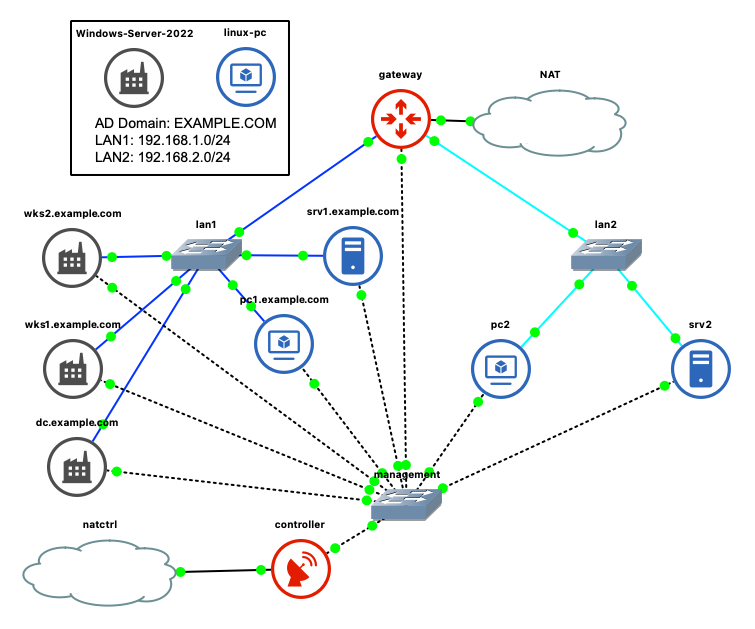

# Ansible playbooks to deploy a Windows AD DC Lab in GNS3 with QEMU

The main goal is to have a working AD DC Lab in a GNS3 with QEMU.

Ansible helps us to automate this task.

Do not use it in production. Only for testing and learning purposes.

## Windows QEMU image

Image used: [Windows Server 2022 rgl/windows-vagrant images](https://github.com/rgl/windows-vagrant)

Always "[sysprep](https://en.wikipedia.org/wiki/Sysprep)" a Windows image before use:

```
C:\Windows\System32\Sysprep\sysprep.exe /generalize /shutdown /oobe /quiet
```

This image is ready to be deployed on the GNS3 server.

## Scenario

Scenario based on: [rgl/windows-domain-controller-vagrant](https://github.com/rgl/windows-domain-controller-vagrant)

Value added:

- GNS3 toplogy
- Ansible playbook

A Domain Controller and two Windows workstations are added in the [osseclab](https://github.com/goffinet/ansible-ccna-lab/blob/master/inventories/custom/osseclab/hosts) GNS3 topology :



In this topology a router named "gateway" acts as an IPv4 Internet Gateway and DHCP/DNS server for the "EXAMPLE.COM" domain. The blue connections are the IP Network segments adressed in 192.168.1.0/24 and in 192.168.2.0/24. Dotted lines are connected to a management switch with a controller that distributes 11.12.13.0/24 management addresses.

## How to use

Setup the controller (Centos):

```bash
curl -s https://raw.githubusercontent.com/goffinet/ansible-ccna-lab/master/tests/setup-controller.sh -o controller_setup.sh
bash controller_setup.sh
reboot
```

Install all requirements on this Centos host:

```bash
yum -y install git
git clone https://github.com/goffinet/ansible-windows-dc
cd ansible-windows-dc
bash -x ansible_setup.sh
```

Look at the inventory:

```
inventory/
├── group_vars
│   ├── all
│   └── domain_controllers
└── hosts
```

Look at the main inventory file `inventory/hosts`:

```
[domain_controllers]
dc ansible_host=11.12.13.117 ip_address=192.168.1.99 ip_gateway=192.168.1.1

[servers]

[linux]
pc1
srv1

[workstations]
wks1 ansible_host=11.12.13.104
wks2 ansible_host=11.12.13.110

[windows:children]
domain_controllers
servers
workstations

[windows:vars]
ansible_user=vagrant
ansible_password=vagrant
ansible_shell_type=cmd
ansible_connection=winrm
ansible_winrm_transport=basic
ansible_port=5985

[linux:vars]
ansible_user=root
ansible_password=testtest

[all:vars]
ansible_ssh_common_args='-o StrictHostKeyChecking=no'
dns_domain_name="example.com"
domain_netbios_name="EXAMPLE"
domain_dn="DC=example,DC=com"
main_password="HeyH0Password"
```

AD users list is stored in the `inventory/domain_controllers`:

```yaml
domain_users:
  - firstname: "john"
    surname: "doe"
    password: "{{ main_password }}"
    password_never_expires: yes
    groups:
      - "Domain Admins"
  - firstname: "jane"
    surname: "doe"
    password: "{{ main_password }}"
    password_never_expires: yes
    groups:
      - "Domain Admins"
managed_sa: sa_test
```

Look at the `site.yml` playbook:

```yaml
---
- import_playbook: playbooks/setup_domain_controller.yml
- import_playbook: playbooks/configure_domain_controller.yml
- import_playbook: playbooks/setup_windows_workstations.yml
- import_playbook: playbooks/install_chocolatey.yml
- import_playbook: playbooks/setup_linux.yml
```

Usage:

- Start the machines
- For Windows hosts:
    - Start a first session in a locale console (VNC)
    - Get the IP management address (cmd.exe / ipconfig / logoff) in the 11.12.13.0/24 range
    - Update the inventory `ansible_host` variable for each windows hosts
- Test the ansible "winrm" connection:
  ```bash
  ansible -m win_ping windows
  ```
- Test the ansible "ssh" connection:
  ```bash
  ansible -m win_ping windows -e "ansible_connection=ssh ansible_port=22"
  ansible -m ping linux
  ```
  - Launch the main playbook:
  ```bash
   ansible-playbook site.yml
  ```

## Test the authentication

From pc1.example.com:

```
pc1 login: john.doe@example.com
Password:
Creating home directory for john.doe@example.com.

[john.doe@example.com@pc1 ~]$ pwd
/home/john.doe@example.com
[john.doe@example.com@pc1 ~]$ ssh wks1
The authenticity of host 'wks1 (192.168.1.184)' can't be established.
ECDSA key fingerprint is SHA256:VxeAoogkvdtiGzQlSD2C0JM7OREL/kEcfWOjNtVl/5o.
ECDSA key fingerprint is MD5:67:c1:2f:ca:d6:64:b7:03:3a:f8:8f:53:08:42:44:dd.
Are you sure you want to continue connecting (yes/no)? yes
Warning: Permanently added 'wks1,192.168.1.184' (ECDSA) to the list of known hosts.
john.doe@example.com@wks1's password:

Microsoft Windows [Version 10.0.20348.1249]
(c) Microsoft Corporation. All rights reserved.

example\john.doe@WKS1 C:\Users\john.doe>powershell

Windows PowerShell
Copyright (C) Microsoft Corporation. All rights reserved.

Install the latest PowerShell for new features and improvements! https://aka.ms/PSWindows

PS C:\Users\john.doe> $env:UserName
john.doe
PS C:\Users\john.doe> $env:UserDomain
EXAMPLE
PS C:\Users\john.doe> $env:ComputerName
WKS1
PS C:\Users\john.doe> exit

example\john.doe@WKS1 C:\Users\john.doe>exit
Connection to wks1 closed.
[john.doe@example.com@pc1 ~]$ exit
logout
```

## Credits

- [Windows Server 2022 rgl/windows-vagrant images](https://github.com/rgl/windows-vagrant)
- [rgl/windows-domain-controller-vagrant](https://github.com/rgl/windows-domain-controller-vagrant)
- [WSMan Test Environment](https://github.com/jborean93/wsman-environment)
